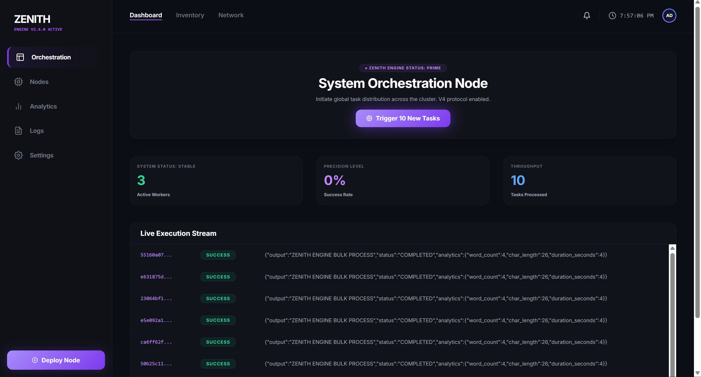

<div align="center">

# ⚡ ZENITH ORCHESTRATOR

### A real-time distributed task orchestration engine built with FastAPI, Celery, Redis, and React.

[](https://fastapi.tiangolo.com/)
[](https://docs.celeryq.dev/)
[](https://redis.io/)
[](https://www.postgresql.org/)
[](https://react.dev/)
[](https://docs.docker.com/compose/)

</div>

---

## Why This Project

Most task queue tutorials stop at "hello world" — a single worker, no persistence, no real-time feedback, no failure handling. I built Zenith Engine to go further.

The goal was to design and ship a **production-grade distributed system** from scratch — one where tasks are dispatched across workers, retried on failure, persisted to a database, and reflected live in a dashboard without any page refresh.

This project taught me how real backend infrastructure actually works: how Celery and Redis coordinate work across multiple processes, how WebSockets maintain persistent connections and recover from drops, how rate limiting protects an API under load, and how Docker Compose ties heterogeneous services into a single deployable unit.

It's not a tutorial project. Every architectural decision — from the dead-letter queue to the WS notify callback — was made to solve a real problem.

---

## Architecture

```
┌─────────────────────────────────────────────────────┐
│                  docker-compose.yml                 │
│                                                     │
│   ┌──────────────────┐      ┌───────────────────┐   │
│   │   star_app:8000  │      │  star_redis:6379  │   │
│   │  FastAPI + WS    │◄────►│  Broker + Cache   │   │
│   │  Manager         │      └───────────────────┘   │
│   └────────┬─────────┘               │              │
│            │                         ▼              │
│   ┌────────▼─────────┐      ┌───────────────────┐   │
│   │   star_db:5432   │◄─────│  worker (n pods)  │   │
│   │   PostgreSQL 15  │      │  Celery · tasks   │   │
│   └──────────────────┘      └───────────────────┘   │
│                                      │              │
│                             ┌────────▼──────────┐   │
│                             │ star_flower:5555  │   │
│                             │ Monitor dashboard │   │
│                             └───────────────────┘   │
└─────────────────────────────────────────────────────┘
                      ▲
              Browser (React :3000)
```

**Request → Result flow:**

1. React frontend triggers a POST to `/tasks/trigger` with an API key header
2. FastAPI checks the Redis rate limit (5 tasks/min), then dispatches 10 Celery tasks via `apply_async`
3. Each Celery worker picks up a task from the Redis queue, processes it (with retry + exponential backoff on failure)
4. On completion, the worker hits `/ws-internal/notify/{task_id}` → FastAPI broadcasts `TASK_UPDATE` over WebSocket
5. The React dashboard receives the WS event and refreshes the task table — no polling needed

---

## Tech Stack

| Layer | Technology | Role |
|---|---|---|
| **API** | FastAPI + Uvicorn | Async REST endpoints, WebSocket manager |
| **Task Queue** | Celery 5 | Distributed task dispatch, retry logic, DLQ |
| **Broker / Cache** | Redis 7 | Message broker + rate limit counter |
| **Database** | PostgreSQL 15 + SQLAlchemy | Task persistence, analytics queries |
| **Frontend** | React 18 + Tailwind CSS | Real-time dashboard, WebSocket client |
| **Charts** | Recharts | Live efficiency/load area chart |
| **Monitoring** | Flower | Celery worker + task monitor |
| **Containerisation** | Docker + Docker Compose | Full stack in one command |
| **Auth** | Custom API key header | Route-level dependency injection |

---

## Key Features

- **Real-time updates** via persistent WebSocket connection with auto-reconnect
- **Distributed task processing** across scalable Celery workers (concurrency=10)
- **Retry + dead-letter queue** — failed tasks retry 3x with exponential backoff, then land in DLQ
- **Rate limiting** — Redis-backed sliding window (5 tasks / 60s per user)
- **Live analytics** — success rate, throughput, avg processing time from DB aggregations
- **Docker infrastructure API** — deploy and inspect containers at runtime via Docker SDK
- **Flower monitoring** at `:5555` for real-time worker and task visibility

---
## 🚀 Live Dashboard Preview



## Getting Started

### Prerequisites

- Docker + Docker Compose
- Node.js 18+ *(only for local frontend development — not required for Docker setup)*

### Run the full stack

```bash
# Clone the repo
git clone https://github.com/shrajal01/zenith-orchestrator.git
cd zenith-orchestrator

# Set up environment variables
cp .env.example .env

# Start all services
docker compose up --build
```

| Service | URL |
|---|---|
| API | http://localhost:8000 |
| API Docs | http://localhost:8000/docs |
| Dashboard | http://localhost:3000 |
| Flower | http://localhost:5555 |

### Run frontend separately (dev mode)

```bash
cd frontend
npm install
npm start
```

---

## API Reference

| Method | Endpoint | Auth | Description |
|---|---|---|---|
| `GET` | `/health` | — | Redis + API health check |
| `POST` | `/tasks/trigger` | API Key | Dispatch 10 bulk tasks |
| `GET` | `/tasks/all` | — | Fetch all tasks from DB |
| `GET` | `/task-status/{id}` | — | Get single task status |
| `GET` | `/analytics/stats` | — | Success rate, throughput, avg time |
| `POST` | `/deploy` | — | Spin up a Docker worker node |
| `GET` | `/api/inventory` | — | Cluster resource inventory |
| `GET` | `/api/network` | — | Live container network status |
| `WS` | `/ws/tasks` | — | WebSocket — real-time task events |

---

## Project Structure

```
zenith-engine/
├── app/
│   ├── core/
│   │   └── database.py        # SQLAlchemy engine + session
│   ├── models/
│   │   └── task.py            # TaskModel ORM
│   ├── workers.py             # Celery app config
│   ├── tasks.py               # process_heavy_data task
│   └── main.py                # FastAPI app + all endpoints
├── frontend/
│   └── src/
│       ├── hooks/
│       │   └── useTasks.js    # Data fetching + WebSocket logic
│       └── App.js             # UI + tab routing
├── docker-compose.yml
├── Dockerfile
├── requirements.txt
└── stress_test.py
```

---

## Environment Variables

```env
# Database
POSTGRES_USER=your_user
POSTGRES_PASSWORD=your_password
POSTGRES_DB=star_db

# Redis
REDIS_URL=redis://redis:6379/0

# Auth
ZENITH_API_KEY=your_api_key

# Frontend
REACT_APP_ZENITH_API_KEY=your_api_key
```

---

<div align="center">

Built by **Shrajal Pandey** 

</div>